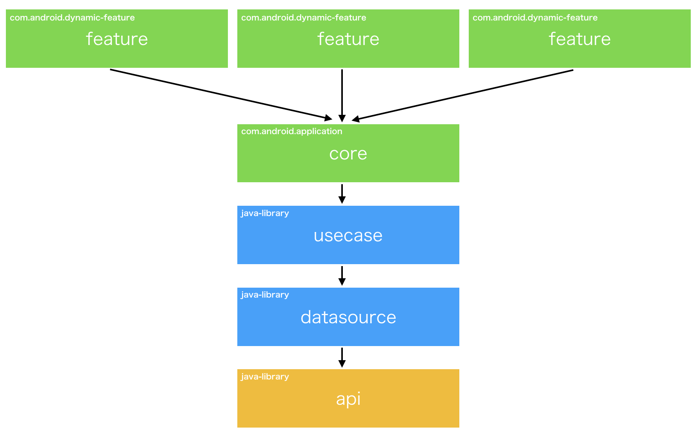

# MultipleModuleSample

Dynamic Feature Module を利用したマルチモジュールプロジェクトのサンプル。
マルチモジュールのメリットを享受しつつ、モジュール間の依存関係をシンプルにしている。

## 目的

マルチモジュールは色々なメリットが存在するが、主な目的は

* 構成自体で設計の制約を持たせることでどこに実装するのかを制限し、初期開発者以外の改修、機能追加時の設計の破綻をなくしたい

Android への依存(特に Context) を減らしてテストを容易にする効果も副次的に狙っている。

## 構成

### feature

全ての機能は Dynamic Delivery を使うかどうかに関わらず、`com.android.dynamic-feature` を利用し、`core` モジュールに依存する。

`feature` 間の依存はなくし、画面遷移は `core` モジュールで定義した Navigation Graph を通じて行う。

アーキテクチャなどに制限はないが、`usecase` の API を呼び出して、受け取ったデータを表示するだけなので、Android Architecture Component の ViewModel を利用した MVVM あたりを想定している。

### core

* Application クラス
* エントリポイントな Activity
* Navigation Graph
* DI 周りの実装
  * 利用する DI ライブラリに制限していない

を担当

複数の feature から利用されるリソースも `core` モジュールに持たせる

### usecase

何かしらのインプットやアクションを受けて、処理を行い、何かしらのアウトプットを返却する API の interface を定義する。

1クラスに 1API を定義し、ユースケースを明確にし、他のユースケースに依存しないようにする。

### datasource

アプリで利用するモデルクラスとリポジトリの interface を定義する。

Android に関係する DB、SharedPreferences は別モジュールで定義し、Inject する。
どこから(API, DB, SharedPreferences, メモリなど)取得するのかは実装側の責務。

### api

API の I/F 定義とリクエスト、レスポンスのモデルを定義する。
アプリの仕様が混ざらないように、API の I/F をそのまま実装する。

## 注意点

* Dynamic Feature Module を利用するので beta 申請が必要
* 別モジュールのクラスを Navigation で利用するのでクラス解決ができない
